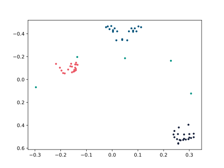

# mslr30
Mexican sign language recognition keypoints dataset of 30 signs

This repository provides the code and configuration to download the *Mexican Sign Language Recognition* dataset described at <https://github.com/ICKMejia/Mexican-Sign-Language-Recognition> and provided as a Google Drive share at <https://drive.google.com/drive/folders/1AOODxR8KOliDrODS9kFJYKDWZC6DchyH?usp=sharing>.

Alternative downloads of the (1) testing folder and (2) training and validation folder are provided [here (1)](https://github.com/krontzo/mslr30/releases/download/v0.0.0/MSLR-Testing.zip) and [here (2)](https://github.com/krontzo/mslr30/releases/download/v0.0.0/MSLR-TrainingValidation.zip)

## Example

This is an example of a plot of a frame of the XY keypoints for a frame of sign

